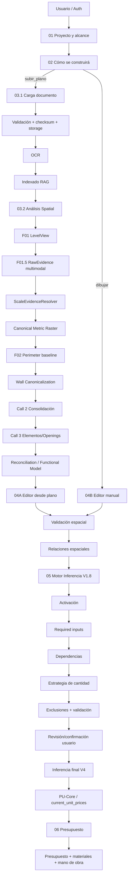

# QUANTIA — Proceso completo desde cero

**Documento maestro de proceso, arquitectura y responsabilidades internas**  
**Proyecto:** Quantia V2L / Quantia Vivienda  
**Fecha de recuperación:** 2026-09-29  
**Propósito:** documentación técnica y funcional del proceso completo de Quantia, no únicamente del pipeline de Quantia Spatial.

---

## 0. Alcance y criterio de recuperación

Este documento reconstruye Quantia desde el inicio de una sesión/proyecto hasta la generación del presupuesto final. Describe tanto el flujo visible para el usuario como los procesos internos que deben ejecutar Frontend, Backend, motores de documentos, Quantia Spatial, editor paramétrico, motor de inferencia de cantidades y PU-Core.

La recuperación se realizó usando como fuentes de verdad, en este orden:

1. **Código actual de `QuantiaV2L.zip`**, auditado directamente.
2. **Documentación/versionado incluida en el propio ZIP**, especialmente `Backend/app/quantia_spatial/documentation/`.
3. **Histórico técnico `chat3(1).txt`**, para recuperar decisiones posteriores que todavía no están completamente integradas en el código actual.
4. Los tests/probes existentes, exclusivamente como evidencia diagnóstica. Un test no redefine por sí mismo la arquitectura ni obliga el resultado del motor.

Cuando existe diferencia entre el código vigente y una decisión posterior del histórico, este documento la marca explícitamente como **OBJETIVO VIGENTE / AÚN NO CONSOLIDADO EN CÓDIGO**. No se presenta una propuesta como si ya estuviera implementada.

### Estados usados en este documento

| Estado | Significado |
|---|---|
| **IMPLEMENTADO** | Existe en el código actual y forma parte del flujo ejecutable. |
| **VALIDADO** | Además de estar implementado, existe evidencia explícita de validación/regresión aceptada. |
| **EXPERIMENTAL** | Existe código/probe, pero todavía no debe tratarse como verdad productiva. |
| **OBJETIVO VIGENTE** | Decisión arquitectónica actual que guía la siguiente implementación, pero todavía no está cerrada en el ZIP auditado. |
| **PENDIENTE** | Funcionalidad, definición o validación todavía no resuelta. |
| **LEGACY** | Código conservado por compatibilidad/histórico que no debe usarse para redefinir el motor canónico actual. |

---

# 1. Qué es Quantia dentro de esta arquitectura

Quantia no es solamente el reconocimiento de planos. Es un sistema de generación y consolidación de información de obra que transforma:

**definición del proyecto + criterios constructivos + geometría arquitectónica + reglas de inferencia + catálogo de conceptos + precios unitarios**

en:

**modelo de proyecto validado + cantidades de obra confirmadas + presupuesto y salidas imprimibles**.

La arquitectura funcional queda separada en seis grandes etapas de usuario:

```text
Acceso / Proyecto
        ↓
01 — Proyecto y alcance
        ↓
02 — Cómo se construirá
        ↓
03 — Obtención de información espacial
        ├─ 03.1 Carga de documentos
        └─ 03.2 Análisis con IA
                 o
        └─ Ruta alternativa: diseño manual
        ↓
04 — Diseño / revisión del modelo de vivienda
        ↓
05 — Cálculo e inferencia de cantidades
        ↓
06 — Presupuesto y resultados
```

Internamente, esas seis etapas se apoyan en subsistemas distintos:

```text
Frontend / Pinia / editor
        │
        ├── Auth / usuarios / cotizaciones
        ├── Documentos / OCR / RAG
        ├── Quantia Spatial
        │      ├── F01 LevelView
        │      ├── F01.5 RawEvidence
        │      ├── escala / raster métrico canónico
        │      ├── F02 perímetro
        │      ├── reconstrucción de muros
        │      ├── canonicalización / consolidación
        │      └── elementos arquitectónicos
        ├── modelo espacial editable
        ├── relaciones espaciales
        ├── Motor de Inferencia V1.8
        ├── catálogo maestro
        └── PU-Core / precios unitarios
```

---

# 2. Principio arquitectónico central: una sola verdad de proyecto, varias fuentes de evidencia

Quantia debe evitar que cada etapa cree una versión independiente del proyecto.

El flujo correcto es:

```text
CAPTURA
  ↓
EVIDENCIA
  ↓
NORMALIZACIÓN
  ↓
HIPÓTESIS / PROPUESTAS
  ↓
VALIDACIÓN
  ↓
CONFIRMACIÓN
  ↓
CONTRATO CANÓNICO
  ↓
CONSUMO POR LA SIGUIENTE ETAPA
```

Por ello:

- la IA **propone e interpreta**;
- la geometría y las reglas deterministas **miden y validan**;
- el usuario confirma datos críticos cuando la evidencia no es suficiente;
- una etapa posterior no debe inventar datos faltantes para “hacer pasar” el flujo;
- las salidas deben conservar procedencia y estado;
- cambiar una decisión anterior invalida de forma controlada las etapas dependientes.

---

# 3. Proceso 0 — Acceso, identidad y creación del estado de proyecto

**Estado: IMPLEMENTADO**

Antes del workflow de vivienda, Quantia dispone de autenticación y persistencia de usuario/proyecto.

## 3.1 Autenticación

Backend:

```text
Frontend
  ↓ credenciales
POST /auth
  ↓
tabla app_users
  ↓
token Bearer firmado
  ↓
acceso a recursos protegidos
```

El backend implementa tokens tipo JWT HS256 propios, con `iss = quantia-backend`. La duración por defecto configurada es de **8 horas**, salvo cambio mediante `AUTH_TOKEN_TTL_SECONDS`.

Responsabilidades internas:

1. validar credenciales;
2. localizar/crear usuario en `app_users`;
3. emitir token con `sub`, email, `iat` y `exp`;
4. validar firma, emisor y expiración en cada recurso protegido;
5. impedir acceso a documentos de otro usuario.

## 3.2 Estado de proyecto/cotización

La persistencia de cotizaciones usa `app_cotizaciones`. El estado del workflow también se mantiene en el store de Vivienda.

El proyecto comienza con bloques independientes:

- prestador;
- cliente;
- ubicación;
- identificación del proyecto;
- aceptación de términos;
- clasificación;
- alcance;
- condiciones constructivas;
- modelo espacial;
- módulos;
- revisión de inferencia;
- resultado.

Este diseño permite invalidar solamente lo que depende de una decisión modificada.

---

# 4. Etapa 01 — Proyecto y alcance

**Estado: IMPLEMENTADO**

Ruta:

`/vivienda/workflow/proyecto-alcance`

Objetivo: definir **qué proyecto es**, **qué tipo de intervención se realizará** y **qué módulos del motor tienen sentido**.

## 4.1 Captura base

Se registran, entre otros:

- datos del prestador;
- cliente;
- ubicación;
- nombre/folio/fecha del proyecto;
- tipo de intervención;
- alcance;
- partidas o etapas activas.

## 4.2 Clasificación de intervención

Los tipos vigentes son:

```text
obra_nueva
remodelacion
complementaria
```

La clasificación no es una etiqueta visual; modifica el escenario que puede inferirse.

### Obra nueva

Tiene alcances automáticos:

```text
obra_negra
obra_gris
obra_completa
```

La capa de servicio incluye `preliminares` dentro de la experiencia funcional. El store del motor mantiene `preliminares` separado y activa posteriormente:

- obra negra → cimentación + estructura + albañilería;
- obra gris → cimentación + estructura + albañilería + instalaciones;
- obra completa → cimentación + estructura + albañilería + instalaciones + acabados + complementarios/equipamiento.

### Remodelación / complementaria

El usuario selecciona etapas de forma más explícita. En remodelación se exige al menos una etapa base dentro del grupo definido por la aplicación.

## 4.3 Proceso interno

```text
captura usuario
   ↓
normalización de claves
   ↓
validación tipo_intervencion
   ↓
validación alcance compatible
   ↓
derivación de módulos activos
   ↓
persistencia en store
   ↓
invalidación de etapas posteriores si cambió el escenario
```

## 4.4 Salida canónica de la etapa

Debe quedar resuelto:

```text
clasificacion.tipoIntervencion
alcance.alcance
alcance.modulosActivos
alcance.partidasSeleccionadas
alcance.subalcances
```

No deben calcularse cantidades todavía.

## 4.5 Regla de invalidación

Si cambia clasificación o alcance, Quantia elimina el estado dependiente desde `preliminares` en adelante. Esto evita conservar cantidades o geometría calculadas para un escenario anterior.

---

# 5. Etapa 02 — Cómo se construirá

**Estado: IMPLEMENTADO**

Ruta:

`/vivienda/workflow/como-se-construira`

Objetivo: convertir el alcance comercial/funcional en **variables técnicas consumibles por el motor**.

## 5.1 Información capturada

El formulario vigente considera:

- topografía;
- condición del terreno;
- acceso;
- profundidad/desnivel cuando aplica;
- sistema estructural;
- tipo de cimentación;
- tipo de losa;
- servicios/instalaciones;
- datos de demolición cuando la intervención lo requiere;
- modalidad de diseño.

Servicios principales se expresan de forma explícita para:

```text
agua
energia
drenaje
```

## 5.2 Modalidad de diseño

Dos salidas:

```text
modo_diseno = subir_plano
    → Etapa 03.1 Documentos

modo_diseno = dibujar
    → Etapa 04B Editor manual
```

Éste es un punto fundamental: ambas rutas deben terminar produciendo **el mismo tipo de contrato espacial**, para que el motor de cantidades no dependa de cómo se obtuvo el diseño.

## 5.3 Transformación interna

Los valores visibles se convierten a datos técnicos en:

- `preliminares`;
- `datosGeneralesObra`;
- `datosGeneralesObra.engineInputs`;
- variables de entrada derivadas.

Ejemplos de claves utilizadas internamente:

```text
sistema_estructural
tipo_cimentacion
tipo_losa
modo_diseno
topografia
servicios
demolicion
```

## 5.4 Validaciones

Antes de continuar:

- los campos estructurales obligatorios deben existir;
- si la topografía requiere magnitud, debe capturarse;
- si existe demolición, deben completarse sus datos mínimos;
- debe existir modalidad de diseño.

Un dato “por definir” no debe convertirse silenciosamente en un valor técnico inventado.

## 5.5 Salida

Esta etapa produce el **contexto constructivo**, que después será cruzado con la geometría real y con las reglas de cada concepto.

---

# 6. Etapa 03.1 — Carga, almacenamiento y preparación de documentos

**Estado: IMPLEMENTADO**

Ruta:

`/vivienda/workflow/planos-revision/carga`

Quantia trata el documento como una fuente de evidencia versionable, no como una imagen temporal.

## 6.1 Ingreso

Entradas posibles del subsistema de documentos incluyen PDF y formatos de imagen admitidos por el endpoint.

## 6.2 Validación previa

Antes de procesar:

1. extensión/MIME;
2. tamaño;
3. número de páginas cuando aplica;
4. cuota del usuario;
5. política de retención;
6. checksum para detectar duplicados.

La carga se procesa por bloques y calcula SHA-256.

## 6.3 Persistencia

Estados observados en el backend:

```text
uploaded
   ↓
ocr_processing
   ↓
ocr_completed
   ↓
indexing
   ↓
ready
```

Si un proceso falla:

```text
failed + error_detail
```

El documento no debe declararse `ready` si no existen chunks indexables cuando se solicita indexación.

## 6.4 OCR

El OCR busca extraer contenido textual utilizable por el subsistema documental.

Importante:

**OCR documental no equivale a reconstrucción arquitectónica.**

Su función es recuperar texto y facilitar búsqueda/contexto. La geometría del plano se procesa en Quantia Spatial.

## 6.5 RAG documental

El RAG actual:

```text
texto OCR
   ↓
tokenización
   ↓
chunks con overlap
   ↓
embeddings
   ↓
vector store
   ↓
similarity search
   ↓
top-k
   ↓
prompt grounded
   ↓
respuesta
```

Valores por defecto visibles en configuración:

- chunk size: 150;
- overlap: 30;
- top-k: 3;
- backend vectorial configurable local/Supabase;
- tabla vectorial por defecto: `document_chunks`.

El prompt obliga a responder únicamente con evidencia recuperada y a rechazar preguntas sin respaldo.

## 6.6 Separación RAG vs Spatial

El RAG sirve para:

- consulta de documentos;
- recuperación semántica textual;
- contexto de proyecto.

Quantia Spatial sirve para:

- localizar plantas;
- extraer líneas/geometría;
- interpretar muros;
- escala;
- perímetros;
- relaciones y elementos arquitectónicos.

No deben confundirse ni utilizar el RAG textual como sustituto de la reconstrucción geométrica.

---

# 7. Etapa 03.2 — Análisis arquitectónico con Quantia Spatial

**Estado general: núcleo F01–F02 IMPLEMENTADO; base métrica V2.3 VALIDADA; reconstrucción posterior en maduración**

Ruta frontend:

`/vivienda/workflow/planos-revision/analisis`

El frontend asegura que el documento esté preparado y solicita análisis del plano. Para PDF se utiliza `pdf_render_scale` como escala raster inicial/bootstrap.

La finalidad de Spatial no es “dibujar encima del PDF”, sino convertir la evidencia del plano en entidades geométricas y semánticas auditables.

---

# 8. Quantia Spatial F01 — Identificación y localización de LevelView

**Estado: IMPLEMENTADO**

Entrada:

```text
document_bytes
media_mime_type
source_document_id
render_scale bootstrap
nombres de niveles conocidos, si existen
```

Salida:

```text
QuantiaPhase01Result
  ├─ page_results
  ├─ level_views[]
  ├─ discoveries
  └─ warnings
```

## 8.1 Qué es un LevelView

Un `LevelView` representa una planta/nivel arquitectónico localizado dentro de una página.

Debe conservar:

- ID estable;
- documento origen;
- página;
- nombre del nivel cuando puede resolverse;
- bounding box;
- dimensiones raster;
- transformaciones necesarias;
- referencia de escala si posteriormente se resuelve.

## 8.2 Proceso interno

```text
PDF / imagen
   ↓
lectura de página
   ↓
evidencia vectorial/nombres conocidos
   ↓
detección de vistas/niveles
   ↓
si es necesario: localización Gemini controlada
   ↓
recorte/LevelView estable
   ↓
validación
```

### Regla clave

Gemini no debe utilizarse para fabricar un nivel inexistente. Si la evidencia no permite resolverlo, el resultado debe permanecer no resuelto o advertido.

---

# 9. Quantia Spatial F01.5 — Extracción multimodal no destructiva

**Estado: IMPLEMENTADO**

Entrada:

```text
LevelView
+ documento/raster
+ evidencia Gemini de página, si existe
```

Salida:

```text
EvidencePipelineResult
  ├─ evidence: RawEvidence[]
  ├─ diagnostics
  └─ warnings
```

## 9.1 Fuentes

La fase combina:

### PyMuPDF
Principalmente evidencia vectorial/textual disponible directamente en PDF.

### OpenCV
Evidencia raster:

- segmentos;
- líneas;
- intersecciones;
- contornos/patrones geométricos.

### OCR
Texto detectado dentro del LevelView.

### Gemini
Evidencia semántica estructurada de la página.

## 9.2 Regla de una sola extracción semántica de página

El diseño vigente ejecuta Gemini a nivel de página y distribuye su evidencia a los LevelView correspondientes. F01.5 no dispara por sí misma otra llamada semántica.

## 9.3 Tolerancia a fallos

Cada fuente es independiente.

```text
si PyMuPDF falla → conservar OpenCV/OCR/Gemini
si OpenCV falla  → conservar PyMuPDF/OCR/Gemini
si OCR falla     → conservar demás
si Gemini falla  → conservar evidencia local
```

No se debe fabricar semántica para compensar un proveedor fallido.

## 9.4 EvidenceParameterizer

Después de extraer, cada `RawEvidence` recibe `parameters[]`.

La parametrización:

- agrega interpretación normalizada;
- no borra geometría;
- no borra texto;
- no borra metadata;
- no reemplaza la evidencia original.

## 9.5 EvidenceGeometryValidator

Verifica que la geometría pertenezca al LevelView y registra evidencia inválida sin convertirla silenciosamente en válida.

## 9.6 Provenance

Toda evidencia debe poder rastrearse al menos por:

```text
evidence.id
source
kind
level_view_id
source_document_id
source_page_number
geometry
text
metadata
parameters
```

Este principio es indispensable para explicar después por qué se creó o rechazó un muro/concepto.

---

# 10. Persistencia de Gemini y replay

**Estado: IMPLEMENTADO EN SPATIAL**

La respuesta semántica no debe desperdiciarse ni sobrescribirse.

El flujo conceptual es:

```text
entrada + prompt/schema/modelo
   ↓
hash / call id
   ↓
respuesta cruda
   ↓
normalización
   ↓
histórico JSONL append-only
   ↓
replay cuando la entrada es equivalente
```

Objetivo:

- trazabilidad;
- comparación entre versiones;
- reproducibilidad;
- evitar una llamada nueva cuando ya existe evidencia exactamente reutilizable;
- permitir forzar una nueva extracción cuando sea necesario.

El replay no debe utilizarse si impide obtener una evidencia nueva requerida por un cambio de prompt/schema/contexto.

---

# 11. Resolución de escala y Canonical Metric Raster

**Estado: Canonical Metric Raster V2.3 VALIDADO como base estable**

Problema: un PDF inicialmente se rasteriza con una escala técnica de render, pero eso no significa que los píxeles representen una densidad métrica arquitectónica coherente.

## 11.1 Flujo

```text
render bootstrap
   ↓
F01
   ↓
F01.5 + F02 bootstrap
   ↓
ScaleEvidenceResolver
   ↓
m/px o px/m
   ↓
densidad objetivo = 90 px/m
   ↓
reraster de página
   ↓
reconstrucción de F01.5 sobre raster canónico
   ↓
reproyección de F02 validada
```

## 11.2 Regla crucial

Al rerasterizar:

- se recalcula evidencia raster/local;
- se reproyecta la verdad F02 ya validada;
- la respuesta Gemini se reproyecta;
- **no se vuelve a llamar a Gemini solamente por cambiar la densidad raster**;
- **no se redetecta el perímetro desde cero** durante este ajuste.

## 11.3 Resultado

Todos los motores posteriores pueden trabajar en un sistema de píxeles con densidad arquitectónica consistente, mejorando:

- umbrales geométricos;
- comparación de espesores;
- distancias;
- gaps;
- asociación de elementos;
- conversión a unidades métricas.

---

# 12. Quantia Spatial F02 — Perímetro y muros perimetrales

**Estado: IMPLEMENTADO / base de evidencia estable**

Entrada:

```text
LevelView + RawEvidence[]
```

Salida principal:

```text
PerimeterWallPipelineResult
```

que puede incluir:

- candidatos;
- wall graph;
- reconciliación de evidencia;
- resolución;
- `PerimeterWallLayer`;
- grounding dimensional;
- perímetro editable;
- comparación semántica;
- validación;
- diagnósticos.

## 12.1 Proceso interno real

```text
RawEvidence
   ↓
PerimeterWallGraphBuilder
   ↓
¿grafo cerrado/resuelto?
   ├─ sí → usar candidato del grafo
   └─ no → BoundaryGeometryDetector como recuperación
   ↓
PerimeterEvidenceReconciler
   ↓
PerimeterWallResolver
   ↓
PerimeterWallBuilder
   ↓
PerimeterDimensionGrounder
   ↓
PerimeterSemanticComparator
   ↓
PerimeterDeliveryBuilder
   ↓
PerimeterWallValidator
```

## 12.2 Qué debe decidir F02

F02 resuelve la **evidencia del contorno/perímetro arquitectónico** para el LevelView y produce una capa auditable.

Debe comprobar:

- cierre geométrico;
- consistencia con LevelView;
- wall runs;
- apoyo de evidencia;
- consistencia dimensional;
- relación entre geometría en px y escala métrica cuando existe.

## 12.3 Conflicto semántico

Si el comparador F02↔Gemini reporta conflicto métrico:

- no se reemplaza la geometría del motor por la de Gemini;
- la geometría en píxeles se conserva;
- la métrica final puede quedar `null/CONFLICT`;
- se conserva la comparación para auditoría/futuro entrenamiento.

## 12.4 Distinción crítica: F02 vs reconstrucción final

F02 debe permanecer **inmutable como capa de evidencia/base histórica**.

Sin embargo, la decisión más reciente del proyecto establece que la reconstrucción final **no puede estar obligada a aceptar el perímetro F02 como verdad incuestionable** si el plano original demuestra que está mal.

Por ello la arquitectura objetivo es:

```text
F02 = baseline/evidencia inmutable
        ↓
Consolidación final = puede PROPONER DELTAS de corrección
        ↓
F02 original no se sobrescribe
```

Esto conserva trazabilidad y al mismo tiempo permite corregir el modelo funcional final.

---

# 13. Reconstrucción de muros interiores / núcleo F03 actual

**Estado: IMPLEMENTADO COMO BENCHMARK EN MADURACIÓN; F03 NO CERRADA**

La documentación actual del ZIP fija como benchmark:

**F03 Element Context Isolation V5 + Selection Contracts V1.6**

y mantiene a Spatial como autoridad sobre muros.

La lógica desarrollada hasta este punto busca pasar de evidencia gráfica ruidosa a candidatos físicamente plausibles.

## 13.1 Pipeline conceptual

```text
DrawingModel / evidencia
   ↓
PhysicalStrokeNormalizer
   ↓
ContextRegionDetector
   ↓
ContextRegionAssembler / clasificadores
   ↓
CandidateContextGate
   ↓
CandidateGraph / ConflictGraph
   ↓
GlobalTopologySolver
   ↓
WallTrackConsolidator
   ↓
ParametricWallReconstructor
```

## 13.2 PhysicalStrokeNormalizer

Responsabilidad:

- agrupar trazos que representan la misma pista física;
- evitar tratar múltiples fragmentos gráficos como entidades independientes;
- preparar geometría para detección de bandas y caras.

## 13.3 ContextRegionDetector

Busca regiones/patrones que pueden contaminar la selección de muros, por ejemplo:

- escaleras;
- acabados/rejillas;
- texto;
- cotas;
- mobiliario/hatches;
- patrones de puertas/ventanas.

Su función no es “borrar todo lo que toca una región”, sino aportar contexto y procedencia.

## 13.4 CandidateContextGate

Clasifica candidatos con estados:

```text
ACTIVE
REVIEW
QUARANTINE
```

Reglas generales:

- `ACTIVE`: evidencia suficiente para competir como muro;
- `REVIEW`: ambigüedad relevante; permanece visible al solver;
- `QUARANTINE`: evidencia fuerte de que no debe ingresar como muro.

Un patrón inferido matemáticamente no debe justificar aislamiento duro por sí solo si no existen miembros físicos suficientes.

## 13.5 CandidateGraph / ConflictGraph

El candidato no se decide solamente por su score local. Debe evaluarse en relación con:

- continuaciones;
- junctions;
- conflictos geométricos;
- redundancias;
- topología general.

## 13.6 GlobalTopologySolver

Busca una selección global coherente.

La intención es evitar:

```text
cada línea decide sola si es muro
```

y evolucionar hacia:

```text
la red completa decide qué combinación de tramos produce una estructura arquitectónica coherente
```

## 13.7 Estado observado

La evidencia histórica muestra una mejora importante en aislamiento de falsos positivos; el problema predominante pasó de exceso de ruido a **recall insuficiente y ensamblaje incompleto**.

Por ello, la dirección actual dejó de ser “seguir agregando filtros al ContextGate” y pasó a canonicalización + consolidación global.

---

# 14. Wall Canonicalization — representación unifilar de muros

**Estado: EXPERIMENTAL AISLADO / arquitectura aceptada como paso previo**

Objetivo: transformar representaciones de doble cara, segmentos paralelos y fragmentos redundantes en una sola entidad lógica por muro.

## 14.1 Problema que resuelve

Un muro arquitectónico puede aparecer como:

```text
────────────  cara A
────────────  cara B
```

pero el modelo funcional necesita principalmente:

```text
────────────  eje/centro lógico del muro
```

con atributos asociados:

- espesor;
- orientación;
- longitud;
- procedencia;
- endpoints/junctions;
- clase perimetral/divisoria;
- gaps/openings.

## 14.2 Procesos internos

1. agrupar segmentos físicamente compatibles;
2. estimar dirección axial;
3. estimar espesor a partir de separación entre caras;
4. construir una línea canónica;
5. fusionar fragmentos colineales compatibles;
6. conservar procedencia;
7. identificar gaps entre tramos;
8. no clasificar automáticamente todo gap como muro faltante.

## 14.3 Salida objetivo

```text
Single-Line WallGraph
  ├─ Junction[]
  ├─ Wall[]
  ├─ Gap[]
  └─ provenance
```

Este estado reduce la complejidad visual y es la entrada preferida para la segunda llamada multimodal.

---

# 15. Segunda llamada multimodal — consolidación arquitectónica de muros

**Estado: OBJETIVO VIGENTE; existen probes experimentales, pero la versión final todavía no está cerrada**

Ésta es una de las decisiones más recientes y debe distinguirse de los probes antiguos.

## 15.1 Objetivo

La segunda llamada no debe limitarse a escoger entre candidatos existentes.

Debe recibir suficiente contexto para responder:

- qué muro real debe conservarse;
- qué tramo es falso;
- qué muro falta;
- dónde debe extenderse un muro;
- qué junction debe cerrarse;
- qué gap pertenece a continuidad lógica;
- qué gap parece un opening;
- qué queda incierto;
- si el perímetro baseline necesita corrección.

## 15.2 Entradas requeridas

La prueba anterior demostró que una imagen derivada únicamente del gap audit no ofrece suficiente base visual.

La entrada objetivo debe incluir:

```text
1. Plano / LevelView original limpio y útil
2. WallGraph canónico actual
3. Gaps/junctions relevantes
4. Escala canónica
5. Identificadores de muros/junctions
6. Evidencia resumida necesaria
```

Debe usarse **una representación visual principal por LevelView**, evitando múltiples imágenes redundantes, pero sin sacrificar el contexto global necesario.

## 15.3 Tipo de salida

La llamada debe responder preferentemente mediante **deltas**, no regenerando arbitrariamente todo el proyecto:

```json
{
  "corrections": [
    {
      "action": "ADD_MISSING_WALL",
      "from": "J12",
      "to": "J18"
    },
    {
      "action": "MARK_GAP",
      "wall": "W07",
      "type": "PROBABLE_OPENING",
      "span": [0.42, 0.57]
    }
  ]
}
```

Acciones conceptuales admitidas:

```text
KEEP_WALL
REMOVE_FALSE_WALL
ADD_MISSING_WALL
EXTEND_WALL
MOVE/RECONNECT_JUNCTION
CORRECT_PERIMETER_SEGMENT
WALL_CONTINUITY
PROBABLE_OPENING
UNCERTAIN
```

## 15.4 Regla de gaps

No se debe cerrar físicamente todo hueco.

Ejemplo:

```text
───────       ───────
```

puede significar:

```text
logical_wall_continuity = true
gap_type = PROBABLE_OPENING
```

Así el sistema puede cerrar topológicamente un espacio sin convertir una puerta en muro sólido.

## 15.5 Corrección de perímetro: decisión vigente

La última validación visual mostró que consolidar sobre un perímetro baseline incorrecto arrastra todo el modelo.

Por ello la consolidación objetivo tendrá dos responsabilidades ordenadas:

```text
A. CORRECCIÓN PROPUESTA DEL PERÍMETRO FUNCIONAL
   - eliminar segmento final erróneo
   - mover vértices
   - recalcular esquinas
   - agregar tramo faltante
   - cerrar contorno funcional correcto
   - conservar referencia al F02 original

B. CONSOLIDACIÓN INTERIOR
   - completar divisorios
   - unir continuidades
   - resolver junctions
   - mantener gaps de opening
   - cerrar espacios lógicos
```

F02 no se reescribe: la corrección pertenece al modelo consolidado y debe conservar su delta/procedencia.

## 15.6 Render de validación

La salida visual no debe ser una copia/overlay ambiguo del plano.

Debe existir un render limpio con:

```text
solo perímetro reconstruido
+ muros divisorios consolidados
+ gaps/openings marcados
+ espacios cerrados cuando sea posible
```

El plano original se usa como evidencia de comparación, no como contenido que oculte el resultado reconstruido.

---

# 16. Tercera llamada multimodal — elementos arquitectónicos

**Estado: OBJETIVO VIGENTE; Mini-Engine V2 existe como experimento previo**

Una vez que los muros están suficientemente consolidados, la tercera llamada debe resolver elementos locales.

Clasificación inicial:

```text
DOOR
WINDOW
NOT_OPENING
```

## 16.1 Por qué debe ir después de muros

Puertas y ventanas necesitan un `host_wall` confiable.

Sin muro anfitrión correcto:

- su ubicación puede asociarse al muro equivocado;
- el ancho puede ser incorrecto;
- la orientación puede ser falsa;
- la apertura no puede modificar la topología de forma segura.

## 16.2 Architectural Elements Mini-Engine V1/V2

El ZIP contiene un Mini-Engine desacoplado de F03 para:

```text
DrawingModel F01.5
+ ParametricWall
+ semántica persistida
   ↓
Independent Opening Hypothesis Generator
   ↓
HostWallMatcher
   ↓
FeatureVector + Architectural RAG
   ↓
SemanticResolver opcional
   ↓
ACCEPTED / REVIEW / REJECTED
   ↓
OpeningReconciler
   ↓
ParametricOpening
```

V2 eliminó la dependencia directa de regiones F03 para generación normal de candidatos.

## 16.3 Limitación descubierta en prueba real

La prueba real mostró que un `host score` podía resultar alto aun con distancias geométricas inaceptables por peso excesivo de provenance/support.

También se observó que:

- la dimensión derivaba demasiado del bbox candidato;
- puertas no generalizaban entre casos;
- la capa semántica no estaba actuando todavía como árbitro suficiente.

Por ello **no debe considerarse resuelto el grounding dimensional de openings**.

## 16.4 Contrato de opening objetivo

Un opening final no debe publicarse sólo porque “parece puerta/ventana”.

Debe estar grounded al eje longitudinal de su host:

```text
opening_id
type = DOOR | WINDOW
host_wall_id
offset_start
offset_end
center_on_wall
opening_width
orientation = host_wall.orientation
confidence/state
evidence_ids[]
semantic_call_id
```

## 16.5 Opening Geometry Grounding

Orden correcto:

```text
DETECTAR ELEMENTO
   ↓
LOCALIZAR HOST REAL
   ↓
PROYECTAR SOBRE EL HOST
   ↓
ENCONTRAR LÍMITES DEL VANO
   ↓
CALCULAR DIMENSIÓN
   ↓
CLASIFICAR / CONFIRMAR
   ↓
PUBLICAR
```

Si no se puede determinar de manera coherente ese intervalo, el elemento debe quedar `REVIEW`, no publicarse como opening final.

---

# 17. ReconciliationEngine y modelo funcional

**Estado: OBJETIVO ARQUITECTÓNICO**

El baseline de reconstrucción funcional establece que la salida final no debe depender de una única cadena de filtros.

Arquitectura objetivo:

```text
F01.5 / evidencia multimodal
     ↓
Wall Proposals
Opening Proposals
Room Proposals
Element Proposals
     ↓
Global Reconciliation
     ↓
Functional Building Model
     ↓
DXF / SVG / IFC / BIM
```

## 17.1 WallGraph

Entidad canónica:

```text
Junction = nodo
Wall = arista
```

Cada muro debe conservar:

- geometría;
- eje;
- ancho;
- orientación;
- longitud métrica;
- evidencias;
- openings;
- espacios adyacentes;
- estado.

## 17.2 Opening

Entidad independiente asociada obligatoriamente a `host_wall`.

La presencia de un opening **no destruye la continuidad lógica del muro**.

## 17.3 RoomGraph

Debe constituir una segunda fuente de verdad:

- polígonos de habitaciones;
- cierre;
- adyacencias;
- superficie;
- uso/tipo cuando existe evidencia;
- relación con muros y openings.

La reconstrucción room-first no debe ser simplemente una copia de la salida wall-first. Ambas hipótesis deben poder contrastarse.

## 17.4 Reconciliación

Debe fusionar:

- evidencia geométrica;
- evidencia topológica;
- semántica;
- restricciones métricas;
- wall-first;
- room-first;
- confirmaciones del usuario.

Salida incierta → `REVIEW`.

---

# 18. Etapa 04A — Diseño desde plano / revisión del modelo reconstruido

**Estado: IMPLEMENTADO en editor; calidad final depende de Spatial**

Ruta:

`/vivienda/workflow/diseno-vivienda/plano`

Objetivo: convertir la reconstrucción IA en un contrato editable y confirmado.

## 18.1 Principio

Spatial no debe terminar directamente en cantidades.

Debe existir una capa donde:

- se visualice;
- se corrija;
- se confirme;
- se completen datos;
- se resuelvan inconsistencias.

## 18.2 Esquema espacial del editor

Versión:

`quantia-editor-1.0`

Unidades:

`metros`

Entidades principales:

```text
levels
terrain
spaces
walls
doors
windows
stairs
annotations
```

Cada entidad puede conservar origen/estado, por ejemplo:

```text
source:
  manual
  document
  ai
  rule
  import

state:
  DETECTADO
  INFERIDO
  NO_IDENTIFICADO
  CONFLICTO
  MANUAL
```

## 18.3 WallGraph del editor

A partir de polígonos de espacios:

1. obtener edges;
2. dividir en puntos compartidos;
3. agrupar segmentos equivalentes;
4. asociar propietarios;
5. reutilizar IDs cuando es posible;
6. clasificar exterior/interior/uncertain.

## 18.4 Openings del editor

Puertas/ventanas se anclan a muros.

Al modificar geometría:

1. intentar conservar host;
2. remapear opening si cambió el wall graph;
3. proyectar sobre segmento paralelo compatible;
4. marcar conflicto si ya no puede resolverse.

## 18.5 Herramientas internas

El editor actual incluye subsistemas para:

- geometría;
- wall graph;
- openings;
- constraints;
- niveles;
- serialización;
- snap/grid;
- history undo/redo;
- schemas.

## 18.6 Validación antes de cantidades

Debe comprobarse al menos:

- geometrías válidas;
- alturas/niveles requeridos;
- relaciones wall-opening;
- espacios;
- relaciones espaciales;
- ausencia de referencias rotas relevantes.

---

# 19. Etapa 04B — “Dibújalo tú” / editor manual

**Estado: IMPLEMENTADO**

Ruta:

`/vivienda/workflow/diseno-vivienda/manual`

Esta ruta omite la dependencia obligatoria de Spatial, pero **no omite el contrato espacial**.

Proceso:

```text
usuario dibuja espacios/geometría
   ↓
editor genera entidades canónicas
   ↓
WallGraph
   ↓
openings
   ↓
niveles / alturas
   ↓
validación
   ↓
estructuraEspacial
   ↓
Etapa 05
```

Por tanto:

```text
PLAN ANALIZADO ─┐
                ├─→ contrato espacial común → cantidades
DIBUJO MANUAL ──┘
```

Ésta es la razón por la cual el motor de cantidades puede mantenerse desacoplado de la forma de captura.

---

# 20. Relaciones espaciales y validación de recorrido

**Estado: IMPLEMENTADO**

`spatialRelationsService` normaliza adyacencias por dirección:

```text
N
S
E
W
```

Usa el sentinel:

`__EXTERIOR__`

para representar colindancia exterior.

## 20.1 Validaciones

- IDs válidos;
- evitar autoreferencia;
- reciprocidad de relaciones cuando aplica;
- tratamiento especial de circulaciones/corredores;
- cobertura del conjunto;
- links rotos.

## 20.2 Por qué importa

Las relaciones espaciales no son decoración del editor. Alimentan reglas que pueden depender de:

- exterior/interior;
- baños/cocina/áreas húmedas;
- recorridos;
- superficies;
- elementos por ambiente;
- instalaciones.

---

# 21. Estado global e invalidación en cascada

**Estado: IMPLEMENTADO**

El store contiene una secuencia explícita:

```text
clasificacion
alcance
preliminares
datos_generales
estructura_espacial
colindancias
validacion_espacial
modulos
revision_inferencia
resumen
resultado
```

`resetFrom(step)` elimina ese paso y todos los posteriores.

## 21.1 Ejemplo

Si cambia el sistema constructivo:

```text
datos_generales cambia
   ↓
no es válido conservar:
estructura espacial derivada dependiente
relaciones
módulos
cantidades
resultado
```

Si cambia únicamente un porcentaje del presupuesto, no existe razón para rehacer Spatial.

## 21.2 Regla documental

Toda nueva etapa que se agregue a Quantia debe declarar:

1. qué inputs consume;
2. qué outputs produce;
3. qué decisiones aguas arriba la invalidan;
4. qué datos aguas abajo deben borrarse al cambiar.

---

# 22. Etapa 05 — Motor de cálculo e inferencia de cantidades

**Estado: IMPLEMENTADO; reglas V1.8 son la base declarativa actual**

Ruta:

`/vivienda/workflow/calculo-cantidades`

Éste es un motor de reglas, no una suma de fórmulas fijas por pantalla.

Fuente principal de reglas:

`Backend/data/engine/Reglas_Motor_Inferencia_Quantia_V2_V1_8_DEFINITIVAS.json`

Identidad:

- schema: `1.0`;
- rules: `V1.8-INF-DEFINITIVO`;
- catálogo: `V1.8-CAT-DEFINITIVO`;
- conceptos: **101**;
- activos: **99**;
- inactivos: **EST-008, EST-010**.

---

# 23. Principios del motor de inferencia V1.8

El archivo maestro define principios globales que deben preservarse.

## 23.1 IA propone; no inventa

La IA puede:

- detectar;
- proponer;
- inferir geometría.

Pero datos críticos deben venir de:

```text
project_document_explicit
user_confirmed
ai_geometry_inference
technical_reference
```

en ese orden de prioridad cuando corresponda.

## 23.2 No inventar dimensiones estructurales

Si una regla necesita un dato estructural y no existe evidencia/confirmación:

```text
BLOCKED_MISSING_INPUT
```

No debe utilizarse una dimensión “típica” para hacer avanzar la cantidad.

## 23.3 Ejemplos ≠ defaults universales

Una dimensión usada en documentación, ejemplo o prueba no se convierte automáticamente en parámetro del proyecto.

## 23.4 Dedupe geométrico

La misma geometría no puede cuantificarse dos veces sólo porque fue detectada por dos fuentes.

## 23.5 Precio separado de cantidad

La cantidad debe inferirse sin utilizar el precio para decidir:

- identidad del concepto;
- activación;
- geometría;
- cantidad.

El precio se aplica después.

## 23.6 Conceptos inactivos

Un concepto marcado inactivo no debe publicarse como concepto ejecutable aunque exista una coincidencia geométrica.

---

# 24. Estados del motor de cantidades

Estados declarativos canónicos:

```text
PROPOSED
CONFIRMED
BLOCKED_MISSING_INPUT
BLOCKED_CONFLICT
NOT_APPLICABLE
INACTIVE
```

En frontend se proyectan además estados de revisión como:

```text
review
confirmed
excluded
```

La interfaz no debe confundir “propuesto” con “confirmado”.

---

# 25. Proceso interno de ejecución de un concepto

Para cada concepto, el motor sigue aproximadamente esta cadena:

```text
Concepto catálogo
   ↓
¿está activo?
   ↓
evaluar activation_rule
   ↓
evaluar condiciones de contexto
   ↓
evaluar requerimientos de servicios
   ↓
resolver required_inputs
   ↓
evaluar dependencias
   ↓
ejecutar inference_strategy
   ↓
aplicar exclusiones
   ↓
validar cantidad
   ↓
validaciones declarativas
   ↓
asignar estado
   ↓
si publicable:
aplicar precio unitario
   ↓
resumen
```

## 25.1 Contexto espacial

`_build_spatial_context()` agrega información relevante de:

- espacios;
- niveles;
- áreas;
- perímetros;
- muros;
- openings;
- instalaciones/contexto;
- datos generales.

## 25.2 Activation rule

Cada concepto contiene:

- tipo de activación;
- triggers;
- condiciones;
- prioridad;
- estrategia de derivación;
- invalidaciones;
- alertas;
- acción de salida.

## 25.3 Required inputs

El motor resuelve requisitos desde las fuentes disponibles.

Si falta evidencia requerida:

```text
no fabricar
→ bloquear o dejar pendiente según regla
```

## 25.4 Dependencies

Un concepto puede depender de:

- otro concepto;
- una geometría;
- una definición de proyecto;
- un dato confirmado.

## 25.5 Exclusions

Las exclusiones pueden actuar sobre el mismo objeto/superficie/tramo.

No necesariamente eliminan un concepto para todo el proyecto.

## 25.6 Inference strategy

El motor actual implementa decenas de estrategias, entre ellas:

- área neta;
- perímetro neto;
- longitud de cadenas/trabes/castillos;
- volumen de excavación/relleno;
- conteo por mueble;
- conteo de salidas;
- áreas de acabados;
- peso de acero confirmado.

## 25.7 Validaciones universales

Entre las reglas maestras:

```text
quantity >= 0
unit_matches_catalog
concept_id_matches_catalog
code_matches_catalog
no_duplicate_geometry
all_required_inputs_have_evidence_or_user_confirmation
```

---

# 26. Catálogo, módulos y partidas

El frontend maneja módulos funcionales:

```text
preliminares
cimentacion
estructura
albanileria
instalaciones
acabados
complementarios_y_equipamiento
```

El motor traduce esos módulos a partidas/códigos del catálogo.

La implementación contiene mapeos equivalentes a:

```text
preliminares → PRE
cimentacion → CIM
estructura → EST
albanileria → ALB
instalaciones → HID / SAN / PLU / ELE / GAS
acabados → ACA
complementarios → CAR / CAN / HER / MSA / COM
```

La identidad del concepto debe provenir del catálogo maestro, no de un texto generado por IA.

---

# 27. Flujo de la pantalla 05 — revisión humana de cantidades

La pantalla no publica directamente todo lo que propone el backend.

## 27.1 Simulación de módulos

Para cada módulo requerido:

```text
contexto de proyecto
+ contexto espacial
+ reglas
+ catálogo
   ↓
simularModuloBackend
```

El resultado clasifica:

- propuestos;
- bloqueados;
- no aplicables;
- inactivos;
- seleccionados.

## 27.2 Revisión

El usuario puede confirmar/excluir propuestas según el flujo actual.

La pantalla bloquea continuidad si:

- quedan conceptos en `review`;
- existen conceptos bloqueados;
- no existe ningún concepto confirmado;
- una cantidad confirmada es <= 0.

## 27.3 Edición de cantidad

Si el usuario modifica una cantidad:

```text
quantity >= 0
total = quantity * unitPrice
quantityEdited = true
```

La modificación debe quedar trazable.

## 27.4 Persistencia por módulo

Antes de consolidar:

- se guardan conceptos seleccionados;
- se verifica resumen;
- se compara `selectedTotal` con `summaryTotal`;
- una divergencia superior al 5% provoca error;
- se conserva activation coverage y clasificación.

## 27.5 Inferencia final V4

Después de persistir módulos:

```text
inferirResultadoV4(
  preliminares,
  modulos,
  datosGeneralesObra,
  variablesEntrada,
  estructuraEspacial,
  colindanciasRecorrido,
  validacionEspacial,
  perfil,
  requiredModuleKeys
)
```

Backend:

```text
sanitiza captura
   ↓
valida core
   ↓
normaliza relaciones espaciales
   ↓
ejecuta preliminares
   ↓
ejecuta módulos requeridos
   ↓
verifica conceptos solicitados
   ↓
construye technicalConcepts
   ↓
construye resumen oficial
   ↓
publica resultado/context snapshot
```

El frontend filtra el resultado backend contra los conceptos realmente confirmados y conserva:

- conceptos confirmados;
- pendientes;
- excluidos;
- preview del resultado.

---

# 28. Precios unitarios y PU-Core

**Estado: integración vigente en presupuesto**

La UI de presupuesto declara explícitamente:

**“Precios unitarios provenientes de PU-Core”.**

En backend, la simulación consulta tablas de catálogo/especificación/reglas y `current_unit_prices`.

Regla arquitectónica:

```text
Quantia determina QUÉ y CUÁNTO
PU-Core aporta el PRECIO UNITARIO publicado
```

El precio no debe retroalimentar la identificación geométrica ni la decisión de cantidad.

Si un concepto confirmado no tiene precio unitario válido:

```text
el presupuesto final no se considera válido/imprimible
```

---

# 29. Etapa 06 — Presupuesto y resultados

**Estado: IMPLEMENTADO**

Ruta:

`/vivienda/workflow/presupuesto-resultados`

Entrada:

```text
revisionInferencia.conceptosConfirmados
```

## 29.1 Costo directo

Por concepto:

```text
total_concepto = quantity × unitPrice
```

Costo directo:

```text
CD = Σ total_concepto
```

## 29.2 Parámetros adicionales

La pantalla permite:

```text
indirectos %
financiamiento %
utilidad %
IVA %
```

Cálculo actual:

```text
indirectos     = CD × %indirectos
financiamiento = CD × %financiamiento
utilidad       = CD × %utilidad

subtotal =
CD
+ indirectos
+ financiamiento
+ utilidad

IVA = subtotal × %IVA

presupuesto_total = subtotal + IVA
```

## 29.3 Mano de obra y materiales

El sistema suma breakdowns únicamente si los conceptos los proporcionan.

No debe inventarse una separación mano de obra/materiales cuando el concepto no la contiene.

## 29.4 Salidas

Rutas imprimibles:

```text
/vivienda/print/presupuesto
/vivienda/print/materiales
/vivienda/print/mano-obra
```

La impresión sólo debe habilitarse cuando:

- existen conceptos;
- todos tienen PU válido.

---

# 30. Persistencia y trazabilidad de resultados

Quantia debe conservar distintos tipos de información en capas:

```text
usuario
proyecto/cotización
documentos
OCR
chunks/vector store
evidencia Spatial
históricos Gemini
modelo espacial
relaciones
módulos
revisión humana
resultado inferido
parámetros de presupuesto
presupuesto
```

No deben colapsarse todas las etapas en un único JSON irreversible.

Cada capa debe conservar suficiente procedencia para reconstruir:

- qué entrada produjo el dato;
- qué versión de regla/modelo se utilizó;
- qué fue inferido;
- qué confirmó el usuario;
- qué fue editado;
- qué se descartó.

---

# 31. Contratos canónicos que debe respetar todo el sistema

## 31.1 Documento

Debe incluir:

```text
document_id
user_id
filename
mime
checksum
status
ocr/index state
storage reference
```

## 31.2 RawEvidence

```text
id
source
kind
geometry
text
metadata
parameters
level_view_id
document/page provenance
```

## 31.3 LevelView

```text
id
source_document_id
source_page_number
name
bbox
raster dimensions
coordinate transform
metric scale when resolved
```

## 31.4 Wall

Objetivo final:

```text
wall_id
start/end junction
centerline
thickness
orientation
length_px
length_m
type
state
evidence_ids
adjacent_spaces
openings
```

## 31.5 Gap

```text
gap_id
host_wall/logical_track
span
type:
  WALL_CONTINUITY
  PROBABLE_OPENING
  UNCERTAIN
evidence_ids
```

## 31.6 Opening

```text
opening_id
host_wall_id
type
offset_start
offset_end
center_on_wall
opening_width
orientation
state
evidence_ids
```

## 31.7 Space

```text
space_id
level_id
polygon
area
perimeter
label/type when supported
relations N/S/E/W
state
```

## 31.8 Concept result

```text
concept_id
code
partida
activation
required_inputs
strategy
quantity
unit
status
evidence/source refs
unitPrice
total
user confirmation/edit state
```

---

# 32. Política de incertidumbre

Quantia no debe optimizar por “tener siempre una respuesta”.

La política correcta es:

```text
EVIDENCIA SUFICIENTE
→ publicar

EVIDENCIA PARCIAL
→ REVIEW

FALTA INPUT OBLIGATORIO
→ BLOCKED

CONFLICTO REAL
→ BLOCKED_CONFLICT / CONFLICT

NO APLICA
→ NOT_APPLICABLE
```

En Spatial:

- una línea dudosa no se convierte automáticamente en muro;
- un gap dudoso no se rellena;
- un opening sin host/dimensión grounded no se publica;
- una escala en conflicto no se fuerza.

En cantidades:

- una dimensión no confirmada no se sustituye por una “típica”;
- un concepto inactivo no se activa;
- no se duplica geometría.

---

# 33. Política de llamadas IA

## 33.1 Objetivo

La prioridad no es minimizar tokens de manera absoluta.

La prioridad es:

```text
precisión / probabilidad de éxito
   >
eficiencia del contexto
   >
ahorro bruto de tokens
```

## 33.2 Reglas

- una llamada debe recibir contexto suficiente;
- evitar imágenes redundantes que causen confusión;
- preferir una representación visual principal por LevelView;
- usar el plano completo si el contexto global es necesario;
- usar crops cuando preserven el contexto suficiente;
- persistir toda respuesta válida;
- usar replay sólo cuando realmente es equivalente;
- segunda llamada: corrección/consolidación por deltas;
- tercera llamada: elementos/openings;
- no pedir a Gemini que reconstruya indiscriminadamente todo si puede resolver una tarea acotada con más certeza.

---

# 34. Validación canónica y benchmarks

Casos de referencia usados en el desarrollo Spatial:

```text
Casa Viri
Miguel H
Miguel V
```

Se usan múltiples LevelView y pruebas comunes.

Principio:

**No ajustar el test por caso para obligar el resultado.**

Los tests deben revelar errores del motor, no ocultarlos.

## 34.1 Tipos de validación

### Unitarias
Validan funciones/contratos locales.

### Regresión
Protegen comportamiento estable.

### Probes
Sirven para observar una hipótesis o subsistema aislado.

### Visual core probes
Permiten comparar si la reconstrucción realmente coincide con la arquitectura.

### Prueba real congelada
Evita que una modificación “mejore” el score sólo cambiando la prueba.

## 34.2 Render visual requerido para reconstrucción

Para evaluar muros:

```text
fondo limpio
+ muros reconstruidos
+ openings/gaps
+ IDs opcionales
```

No saturar con:

- todos los candidatos;
- múltiples colores sin necesidad;
- overlay del plano que haga imposible saber qué construyó el motor.

El plano original debe mostrarse como referencia separada cuando se compara.

---

# 35. Estado técnico recuperado al 2026-09-29

## 35.1 Base estable del ZIP

La documentación incluida en el ZIP fija:

**Canonical Metric Raster V2.3 VALIDATED**

como base geométrica estable global.

Benchmark Spatial/F03 contenido:

**Element Context Isolation V5 + Selection Contracts V1.6**

Rama de elementos contenida:

**Architectural Elements Mini-Engine V2**

pero su documento original todavía decía “probe real pendiente”; el histórico posterior ya contiene la ejecución real y sus fallas de grounding.

## 35.2 Lo que puede considerarse consolidado

- workflow 01–06;
- separación plan/manual;
- documentos/OCR/RAG;
- F01 LevelView;
- F01.5 multimodal no destructivo;
- persistencia/replay de evidencia Gemini;
- resolución métrica/raster canónico;
- F02 como baseline de perímetro;
- editor espacial;
- relaciones;
- motor declarativo V1.8;
- revisión humana de cantidades;
- integración de precios;
- cálculo de presupuesto.

## 35.3 Lo que NO debe declararse terminado

- reconstrucción completa de muros en los seis LevelView;
- perímetro funcional final perfecto para todos los casos;
- cierre confiable de espacios;
- puertas;
- ventanas con grounding dimensional completo;
- ReconciliationEngine final;
- RoomGraph final;
- exportación funcional DXF/SVG/IFC/BIM.

---

# 36. Diferencia entre implementación actual y dirección vigente

Éste es el punto más importante para continuar sin mezclar versiones.

## Código actual

```text
F01
→ F01.5
→ Canonical Metric Raster
→ F02 baseline
→ F03 benchmark / selección
→ experimentos canonicalization
→ Mini-Engine V2
```

## Dirección vigente recuperada del histórico

```text
F01.5 evidencia
   ↓
F02 baseline (inmutable como evidencia)
   ↓
Wall Canonicalization
   ↓
Single-Line WallGraph
   ↓
CALL 2
  - revisar/corregir perímetro funcional
  - conservar/eliminar/agregar/extender muros
  - resolver junctions
  - marcar gaps
  - cerrar espacios lógicamente
   ↓
WallGraph consolidado
   ↓
CALL 3
  - DOOR
  - WINDOW
  - NOT_OPENING
   ↓
Opening Geometry Grounding
   ↓
RoomGraph / comprobación de cierre
   ↓
ReconciliationEngine
   ↓
Functional Building Model
   ↓
Editor/confirmación
```

Esta dirección **no autoriza a borrar F02**. Autoriza a que el modelo final guarde una corrección derivada y auditable sobre el baseline.

---

# 37. Proceso end-to-end completo



---

# 38. Secuencia detallada de decisión

```text
1. AUTENTICAR
2. CREAR/RECUPERAR PROYECTO
3. DEFINIR TIPO DE INTERVENCIÓN
4. DEFINIR ALCANCE
5. DERIVAR MÓDULOS
6. CAPTURAR CONDICIONES CONSTRUCTIVAS
7. ELEGIR MODALIDAD DE DISEÑO

8A. SI PLANO:
    8A.1 cargar
    8A.2 validar
    8A.3 almacenar
    8A.4 OCR
    8A.5 RAG documental
    8A.6 F01
    8A.7 F01.5
    8A.8 resolver escala
    8A.9 reraster canónico
    8A.10 F02
    8A.11 canonicalizar muros
    8A.12 consolidar
    8A.13 detectar/ground openings
    8A.14 reconciliar
    8A.15 editor y confirmación

8B. SI MANUAL:
    8B.1 dibujar espacios
    8B.2 construir wall graph
    8B.3 agregar openings
    8B.4 niveles
    8B.5 validar

9. NORMALIZAR RELACIONES ESPACIALES
10. VALIDAR CONTRATO ESPACIAL
11. CONSTRUIR CONTEXTO DEL MOTOR
12. CARGAR CATÁLOGO Y REGLAS
13. EVALUAR CADA CONCEPTO
14. PROPONER/BLOQUEAR/NO APLICAR
15. USUARIO CONFIRMA/EXCLUYE
16. EJECUTAR INFERENCIA FINAL
17. APLICAR PU
18. CALCULAR COSTO DIRECTO
19. APLICAR INDIRECTOS/FINANCIAMIENTO/UTILIDAD/IVA
20. PUBLICAR RESULTADO E IMPRIMIBLES
```

---

# 39. Definiciones todavía pendientes en el flujo general

El código actual conserva pendientes explícitos de definición, entre ellos:

```text
P-001 frontera exacta de obra_gris en obra_nueva
P-002 catálogo oficial de nivel_acabado por módulo
P-003 matriz tipo_intervencion → alcance → partidas activas
P-004 taxonomía final de subalcances por partida
P-005 compatibilidad formal cimentación-estructura
P-007 matriz de instalaciones por ambiente y número de salidas
```

Estos pendientes no deben rellenarse con supuestos en documentación ni código.

---

# 40. Árbol funcional de componentes actuales

```text
QuantiaV2L/
├── Backend/
│   ├── app/
│   │   ├── api/v1/endpoints/
│   │   │   ├── auth.py
│   │   │   ├── catalogos.py
│   │   │   ├── cotizaciones.py
│   │   │   ├── documentos.py
│   │   │   ├── motor.py
│   │   │   └── resultados.py
│   │   ├── services/
│   │   │   ├── document_*
│   │   │   ├── ocr_*
│   │   │   ├── rag_service.py
│   │   │   ├── embedding_service.py
│   │   │   ├── vector_store_service.py
│   │   │   ├── motor_simulation_service.py
│   │   │   └── result_service.py
│   │   ├── quantia_spatial/
│   │   │   ├── engine.py
│   │   │   ├── phase_01_level/
│   │   │   ├── phase_015_evidence/
│   │   │   ├── phase_02_boundaries/
│   │   │   ├── reconstruction_core/
│   │   │   ├── architectural_elements/
│   │   │   ├── parametric_model/
│   │   │   ├── contracts/
│   │   │   ├── models/
│   │   │   ├── providers/
│   │   │   ├── tests/
│   │   │   └── documentation/
│   │   └── legacy/quantia_spatial/
│   └── data/engine/
│       └── Reglas_Motor_Inferencia_Quantia_V2_V1_8_DEFINITIVAS.json
│
├── Frontend/
│   └── src/modules/vivienda/
│       ├── router/
│       ├── store/
│       ├── services/
│       └── views/workflow/
│           ├── 01ProyectoAlcanceView.vue
│           ├── 02ComoSeConstruiraView.vue
│           ├── 03_1CargaDocumentosView.vue
│           ├── 03_2AnalisisIAView.vue
│           ├── 04DisenoViviendaView.vue
│           ├── 04DisenoManualView.vue
│           ├── 05CalculoCantidadesView.vue
│           └── 06PresupuestoResultadosView.vue
│
└── database/
    └── supabase/
```

`Backend/app/legacy/quantia_spatial/` se conserva como legacy. No debe utilizarse para redefinir el motor nuevo mientras no exista instrucción explícita.

---

# 41. Matriz de responsabilidades por subsistema

| Subsistema | Debe hacer | No debe hacer |
|---|---|---|
| Frontend workflow | capturar, validar UX, mostrar estados, pedir confirmación | inventar cantidades técnicas |
| Pinia store | persistir estado de sesión, invalidar cascada | mezclar resultados de escenarios incompatibles |
| Document service | validar, almacenar, versionar documento | interpretar geometría arquitectónica final |
| OCR | recuperar texto | decidir muros |
| RAG | recuperar texto/documentación | sustituir Spatial |
| F01 | localizar niveles/LevelView | reconstruir habitaciones |
| F01.5 | preservar evidencia multimodal | confirmar arquitectura |
| Scale resolver | resolver métrica | inferir elementos |
| F02 | crear baseline perimetral auditable | ocultar conflicto métrico |
| Reconstruction Core | proponer/seleccionar muros | decidir cantidades de obra |
| Call 2 | consolidar/corregir WallGraph mediante deltas | cerrar todos los gaps como sólido |
| Call 3 | clasificar/ground openings | modificar arbitrariamente muros |
| Editor | permitir revisión/corrección | perder procedencia |
| Relations | normalizar adyacencias | inventar espacios |
| Motor V1.8 | activar y cuantificar conceptos | usar PU para decidir cantidad |
| PU-Core | publicar PU/costos | definir geometría |
| Presupuesto | combinar cantidades confirmadas y PU | publicar concepto sin precio válido |

---

# 42. Métricas técnicas recomendadas para cerrar Spatial

El baseline actual ya define métricas futuras que deben mantenerse separadas:

```text
Wall precision / recall / F1
Opening precision / recall / F1
Door host accuracy
Window host accuracy
Junction F1
Room polygon IoU
Room closure
Room adjacency F1
Dangle length
Double-wall errors
Topology validity
Scale error
Edit cost
```

La meta documental del baseline es **95%+ automático**, manteniendo incertidumbre en `REVIEW` antes que introducir errores silenciosos.

---

# 43. Criterio de cierre por etapa

## 43.1 F01
Cerrada cuando identifica correctamente los LevelView necesarios sin inventar niveles.

## 43.2 F01.5
Cerrada cuando conserva evidencia útil y trazable de todas las fuentes, aunque alguna fuente falle.

## 43.3 Escala
Cerrada cuando las dimensiones pueden mapearse consistentemente a unidades métricas o se declara conflicto.

## 43.4 F02
Cerrada como baseline cuando produce un perímetro auditable; no significa que el modelo funcional posterior no pueda corregirlo mediante delta.

## 43.5 Muros
Cerrados cuando la red funcional posee recall y precisión suficientes, junctions coherentes y topología útil.

## 43.6 Openings
Cerrados cuando cada puerta/ventana publicable tiene host e intervalo longitudinal medible.

## 43.7 Espacios
Cerrados cuando los polígonos y adyacencias pueden derivarse sin gaps topológicos críticos.

## 43.8 Editor
Cerrado cuando el usuario puede corregir el modelo sin romper referencias y el contrato serializado vuelve a cargarse.

## 43.9 Cantidades
Cerradas cuando todos los conceptos confirmados poseen inputs trazables, unidad correcta y ausencia de duplicidad.

## 43.10 Presupuesto
Cerrado cuando todas las cantidades confirmadas tienen PU válido y los parámetros económicos están definidos.

---

# 44. Reglas para futuras modificaciones

1. Verificar el archivo actual antes de modificar.
2. Mantener punto de retorno en cambios relevantes.
3. No alterar tests para forzar resultados.
4. No mezclar código legacy con el motor canónico.
5. No reescribir históricos de Gemini.
6. No sobrescribir F02 al aplicar una corrección de consolidación.
7. No publicar `REVIEW` como confirmado.
8. No convertir bboxes visuales directamente en dimensiones de opening sin grounding.
9. No utilizar precios para inferir cantidades.
10. Si cambia una etapa aguas arriba, invalidar explícitamente los resultados dependientes.
11. Cada nuevo contrato debe indicar versión y procedencia.
12. Toda nueva llamada multimodal debe persistir raw + normalizado + metadatos + hashes.

---

# 45. Fuentes concretas auditadas

## Código / configuración

- `Frontend/src/modules/vivienda/router/index.js`
- `Frontend/src/modules/vivienda/store/viviendaStore.js`
- `Frontend/src/modules/vivienda/services/viviendaService.js`
- `Frontend/src/modules/vivienda/services/spatialRelationsService.js`
- `Frontend/src/modules/vivienda/views/workflow/01ProyectoAlcanceView.vue`
- `Frontend/src/modules/vivienda/views/workflow/02ComoSeConstruiraView.vue`
- `Frontend/src/modules/vivienda/views/workflow/03_1CargaDocumentosView.vue`
- `Frontend/src/modules/vivienda/views/workflow/03_2AnalisisIAView.vue`
- `Frontend/src/modules/vivienda/views/workflow/04DisenoViviendaView.vue`
- `Frontend/src/modules/vivienda/views/workflow/04DisenoManualView.vue`
- `Frontend/src/modules/vivienda/views/workflow/05CalculoCantidadesView.vue`
- `Frontend/src/modules/vivienda/views/workflow/06PresupuestoResultadosView.vue`
- `Backend/app/api/v1/endpoints/auth.py`
- `Backend/app/api/v1/endpoints/documentos.py`
- `Backend/app/services/rag_service.py`
- `Backend/app/services/motor_simulation_service.py`
- `Backend/app/services/result_service.py`
- `Backend/app/quantia_spatial/engine.py`
- `Backend/app/quantia_spatial/phase_015_evidence/evidence_pipeline.py`
- `Backend/app/quantia_spatial/phase_02_boundaries/perimeter_wall_pipeline.py`
- `Backend/data/engine/Reglas_Motor_Inferencia_Quantia_V2_V1_8_DEFINITIVAS.json`

## Documentación interna

- `Backend/app/quantia_spatial/documentation/CURRENT_VERSION.txt`
- `Backend/app/quantia_spatial/documentation/CURRENT_STATE.txt`
- `Backend/app/quantia_spatial/documentation/BASELINE_RECONSTRUCCION_FUNCIONAL_2026-09-15.txt`
- `Backend/app/quantia_spatial/documentation/ARCHITECTURAL_ELEMENTS_MINI_ENGINE_V1.txt`
- `Backend/app/quantia_spatial/documentation/ARCHITECTURAL_ELEMENTS_MINI_ENGINE_V2.txt`
- históricos/return points/manifests de `documentation/`

## Histórico recuperado

- `chat3(1).txt`
  - evolución Element Context Isolation;
  - Architectural Core Visual;
  - Mini-Engine V1/V2;
  - Wall Canonicalization;
  - diseño de segunda llamada;
  - necesidad de entregar el plano original como contexto;
  - necesidad de render de reconstrucción limpio;
  - corrección del perímetro funcional antes de consolidación interior.

---

# APÉNDICE A — Inventario del motor V1.8 por partida

- **Acabados:** 15 conceptos
- **Albanileria:** 7 conceptos
- **Canceleria:** 2 conceptos
- **Carpinteria:** 4 conceptos
- **Cimentacion:** 11 conceptos
- **Estructura:** 10 conceptos
- **Herreria:** 2 conceptos
- **Instalacion electrica:** 9 conceptos
- **Instalacion hidraulica:** 10 conceptos
- **Instalacion pluvial:** 3 conceptos
- **Instalacion sanitaria:** 8 conceptos
- **Muebles sanitarios y accesorios:** 6 conceptos
- **Obras complementarias:** 4 conceptos
- **Preliminares:** 10 conceptos

Total: **101 conceptos**; activos: **99**; inactivos: **EST-008, EST-010**.

---

# APÉNDICE B — Estrategias de inferencia implementadas en reglas V1.8

| Estrategia | Conceptos que la usan |
|---|---:|
| `area_andador` | 1 |
| `area_caras_confirmadas` | 1 |
| `area_firme_neta` | 1 |
| `area_firme_reforzado` | 1 |
| `area_muros_mas_boquillas` | 1 |
| `area_neta_confirmada` | 13 |
| `area_neta_losa_maciza` | 1 |
| `area_neta_losa_nervada` | 1 |
| `area_neta_losa_vigueta_bovedilla` | 1 |
| `area_neta_muro_descuentos` | 3 |
| `area_neta_muros_humedos` | 1 |
| `area_neta_piso` | 1 |
| `area_por_espesor_despalme` | 1 |
| `area_real_canceleria` | 1 |
| `balance_tierras_relleno_reutilizable` | 1 |
| `balance_tierras_retiro` | 1 |
| `conteo_bajantes_confirmados` | 1 |
| `conteo_dados_confirmados` | 1 |
| `conteo_electrico_plano_o_propuesta` | 3 |
| `conteo_piezas_confirmadas` | 30 |
| `conteo_por_mueble` | 8 |
| `conteo_por_servicio` | 2 |
| `conteo_salidas_confirmadas` | 6 |
| `conteo_tramites_confirmados` | 1 |
| `conteo_zapata_080` | 1 |
| `conteo_zapata_100` | 1 |
| `corte_topografico_por_superficies` | 1 |
| `excavacion_cimentacion_por_geometria` | 1 |
| `longitud_barandal` | 1 |
| `longitud_cadenas_cerramiento` | 1 |
| `longitud_castillos_unicos` | 1 |
| `longitud_columnas_confirmadas` | 1 |
| `longitud_contratrabe_20x30` | 1 |
| `longitud_dala_desplante` | 1 |
| `longitud_guarnicion` | 1 |
| `longitud_muro_cimentacion` | 1 |
| `longitud_trabes_confirmadas` | 1 |
| `longitud_zapata_corrida` | 1 |
| `perimetro_neto_zoclo` | 1 |
| `perimetro_vanos_y_aristas` | 1 |
| `peso_acero_confirmado` | 1 |
| `suma_areas_intervencion` | 1 |
| `volumen_relleno_neto` | 1 |

---

# APÉNDICE C — Catálogo de 101 reglas de concepto

Esta tabla no sustituye el JSON maestro. Sirve como índice documental de la regla, estrategia e inputs. Ante cualquier diferencia futura, prevalece el archivo de reglas versionado.

| Código | Partida | Activo | Estrategia | Unidad | Inputs requeridos | Dependencias |
|---|---|---:|---|---|---|---|
| `ACA-001` | Acabados | Sí | `area_neta_piso` | `m2` | geometria_area_confirmada | CIM-008\|base_de_piso |
| `ACA-002` | Acabados | Sí | `perimetro_neto_zoclo` | `ml` | espacios_con_zoclo, perimetros, puertas_y_tramos_excluidos | ACA-001\|ACA-101, puertas |
| `ACA-003` | Acabados | Sí | `area_neta_muros_humedos` | `m2` | muros_humedos_confirmados, altura_recubrimiento, vanos | muros_humedos, altura_confirmada |
| `ACA-004` | Acabados | Sí | `area_neta_confirmada` | `m2` | geometria_area_confirmada | — |
| `ACA-004A` | Acabados | Sí | `area_neta_confirmada` | `m2` | geometria_area_confirmada | — |
| `ACA-005` | Acabados | Sí | `area_muros_mas_boquillas` | `m2` | area_muros_pintar, longitud_boquillas_si_aplica | muros_aplanados, ALB-006 |
| `ACA-006` | Acabados | Sí | `area_neta_confirmada` | `m2` | geometria_area_confirmada | ALB-005\|ACA-004A |
| `ACA-007` | Acabados | Sí | `area_neta_confirmada` | `m2` | geometria_area_confirmada | — |
| `ACA-008` | Acabados | Sí | `area_neta_confirmada` | `m2` | geometria_area_confirmada | ALB-007\|area_azotea |
| `ACA-101` | Acabados | Sí | `area_neta_confirmada` | `m2` | geometria_area_confirmada | — |
| `ACA-102` | Acabados | Sí | `area_neta_confirmada` | `m2` | geometria_area_confirmada | — |
| `ACA-103` | Acabados | Sí | `conteo_piezas_confirmadas` | `pza` | cantidad_piezas_confirmada | regadera\|bano |
| `ACA-104` | Acabados | Sí | `conteo_piezas_confirmadas` | `pza` | cantidad_piezas_confirmada | — |
| `ACA-105` | Acabados | Sí | `conteo_piezas_confirmadas` | `pza` | cantidad_piezas_confirmada | lavabo |
| `ACA-106` | Acabados | Sí | `conteo_piezas_confirmadas` | `pza` | cantidad_piezas_confirmada | mueble_sanitario |
| `ALB-001` | Albanileria | Sí | `area_neta_muro_descuentos` | `m2` | muros_sistema_confirmados, vanos, castillos | — |
| `ALB-002` | Albanileria | Sí | `area_neta_muro_descuentos` | `m2` | muros_sistema_confirmados, vanos, castillos | — |
| `ALB-003` | Albanileria | Sí | `area_neta_muro_descuentos` | `m2` | muros_sistema_confirmados, vanos, castillos | — |
| `ALB-004` | Albanileria | Sí | `area_caras_confirmadas` | `m2` | caras_a_aplanar_confirmadas, vanos | — |
| `ALB-005` | Albanileria | Sí | `area_neta_confirmada` | `m2` | geometria_area_confirmada | — |
| `ALB-006` | Albanileria | Sí | `perimetro_vanos_y_aristas` | `ml` | vanos_y_aristas_confirmados | — |
| `ALB-007` | Albanileria | Sí | `area_neta_confirmada` | `m2` | geometria_area_confirmada | — |
| `CAN-001` | Canceleria | Sí | `area_real_canceleria` | `m2` | dimensiones_ventanas_confirmadas | — |
| `CAN-002` | Canceleria | Sí | `conteo_piezas_confirmadas` | `pza` | cantidad_piezas_confirmada | — |
| `CAR-001` | Carpinteria | Sí | `conteo_piezas_confirmadas` | `pza` | cantidad_piezas_confirmada | — |
| `CAR-002` | Carpinteria | Sí | `conteo_piezas_confirmadas` | `pza` | cantidad_piezas_confirmada | — |
| `CAR-003` | Carpinteria | Sí | `conteo_piezas_confirmadas` | `pza` | cantidad_piezas_confirmada | — |
| `CAR-004` | Carpinteria | Sí | `conteo_piezas_confirmadas` | `pza` | cantidad_piezas_confirmada | — |
| `CIM-001` | Cimentacion | Sí | `area_neta_confirmada` | `m2` | geometria_area_confirmada | PRE-003 |
| `CIM-002` | Cimentacion | Sí | `longitud_zapata_corrida` | `ml` | tramos_zapata_corrida_confirmados | PRE-003, CIM-001 |
| `CIM-003` | Cimentacion | Sí | `conteo_zapata_080` | `pza` | cantidad_zapatas_080_confirmada | PRE-003, CIM-001 |
| `CIM-003A` | Cimentacion | Sí | `conteo_zapata_100` | `pza` | cantidad_zapatas_100_confirmada | PRE-003, CIM-001 |
| `CIM-004` | Cimentacion | Sí | `conteo_dados_confirmados` | `pza` | cantidad_dados_confirmada | CIM-003\|CIM-003A |
| `CIM-005` | Cimentacion | Sí | `longitud_dala_desplante` | `ml` | tramos_dala_desplante_confirmados | PRE-003 |
| `CIM-005A` | Cimentacion | Sí | `longitud_contratrabe_20x30` | `ml` | tramos_contratrabe_20x30_confirmados | CIM-002 |
| `CIM-006` | Cimentacion | Sí | `longitud_muro_cimentacion` | `ml` | geometria_longitud_confirmada | PRE-003, CIM-001 |
| `CIM-007` | Cimentacion | Sí | `volumen_relleno_neto` | `m3` | geometria_volumen_confirmada | PRE-006 |
| `CIM-008` | Cimentacion | Sí | `area_firme_neta` | `m2` | geometria_area_confirmada | — |
| `CIM-009` | Cimentacion | Sí | `area_firme_reforzado` | `m2` | geometria_area_confirmada | CIM-008 |
| `COM-001` | Obras complementarias | Sí | `longitud_guarnicion` | `ml` | tramos_guarnicion_confirmados | — |
| `COM-002` | Obras complementarias | Sí | `area_andador` | `m2` | areas_andador_confirmadas | — |
| `COM-003` | Obras complementarias | Sí | `conteo_piezas_confirmadas` | `pza` | cantidad_piezas_confirmada | — |
| `COM-004` | Obras complementarias | Sí | `conteo_piezas_confirmadas` | `pza` | cantidad_piezas_confirmada | sistema_pluvial |
| `ELE-001` | Instalacion electrica | Sí | `conteo_electrico_plano_o_propuesta` | `sal` | cantidad_salidas_confirmada | — |
| `ELE-002` | Instalacion electrica | Sí | `conteo_electrico_plano_o_propuesta` | `sal` | cantidad_salidas_confirmada | — |
| `ELE-003` | Instalacion electrica | Sí | `conteo_salidas_confirmadas` | `sal` | cantidad_salidas_confirmada | — |
| `ELE-004` | Instalacion electrica | Sí | `conteo_electrico_plano_o_propuesta` | `sal` | cantidad_salidas_confirmada | — |
| `ELE-005` | Instalacion electrica | Sí | `conteo_salidas_confirmadas` | `sal` | cantidad_salidas_confirmada | — |
| `ELE-006` | Instalacion electrica | Sí | `conteo_salidas_confirmadas` | `sal` | cantidad_salidas_confirmada | — |
| `ELE-007` | Instalacion electrica | Sí | `conteo_salidas_confirmadas` | `sal` | cantidad_salidas_confirmada | — |
| `ELE-008` | Instalacion electrica | Sí | `conteo_piezas_confirmadas` | `pza` | cantidad_piezas_confirmada | — |
| `ELE-009` | Instalacion electrica | Sí | `conteo_piezas_confirmadas` | `pza` | cantidad_piezas_confirmada | — |
| `EST-001` | Estructura | Sí | `longitud_castillos_unicos` | `ml` | castillos_unicos_confirmados, alturas_nivel | muros, vanos, niveles |
| `EST-002` | Estructura | Sí | `longitud_cadenas_cerramiento` | `ml` | tramos_cadena_confirmados | muros, vanos, pretiles |
| `EST-003` | Estructura | Sí | `longitud_columnas_confirmadas` | `ml` | columnas_confirmadas, alturas_nivel | — |
| `EST-004` | Estructura | Sí | `longitud_trabes_confirmadas` | `ml` | trabes_confirmadas, longitudes | — |
| `EST-005` | Estructura | Sí | `area_neta_losa_maciza` | `m2` | poligono_losa, huecos_no_losa | — |
| `EST-006` | Estructura | Sí | `area_neta_losa_vigueta_bovedilla` | `m2` | poligono_losa, huecos_no_losa, sistema_confirmado | — |
| `EST-007` | Estructura | Sí | `area_neta_losa_nervada` | `m2` | poligono_losa, huecos_no_losa, sistema_confirmado | — |
| `EST-008` | Estructura | No | `area_neta_confirmada` | `m2` | geometria_area_confirmada | — |
| `EST-009` | Estructura | Sí | `peso_acero_confirmado` | `kg` | despiece_o_peso_acero_confirmado | — |
| `EST-010` | Estructura | No | `conteo_piezas_confirmadas` | `pza` | cantidad_piezas_confirmada | — |
| `HER-001` | Herreria | Sí | `conteo_piezas_confirmadas` | `pza` | cantidad_piezas_confirmada | — |
| `HER-002` | Herreria | Sí | `longitud_barandal` | `ml` | tramos_barandal_confirmados | — |
| `HID-001` | Instalacion hidraulica | Sí | `conteo_por_mueble` | `sal` | cantidad_salidas_confirmada | MSA-001 |
| `HID-002` | Instalacion hidraulica | Sí | `conteo_por_mueble` | `sal` | cantidad_salidas_confirmada | MSA-002\|ACA-105 |
| `HID-003` | Instalacion hidraulica | Sí | `conteo_por_mueble` | `sal` | cantidad_salidas_confirmada | MSA-003 |
| `HID-004` | Instalacion hidraulica | Sí | `conteo_por_mueble` | `sal` | cantidad_salidas_confirmada | MSA-004 |
| `HID-005` | Instalacion hidraulica | Sí | `conteo_por_servicio` | `sal` | cantidad_salidas_confirmada | lavadora\|servicio |
| `HID-006` | Instalacion hidraulica | Sí | `conteo_piezas_confirmadas` | `pza` | cantidad_piezas_confirmada | — |
| `HID-007` | Instalacion hidraulica | Sí | `conteo_piezas_confirmadas` | `pza` | cantidad_piezas_confirmada | — |
| `HID-008` | Instalacion hidraulica | Sí | `conteo_piezas_confirmadas` | `pza` | cantidad_piezas_confirmada | — |
| `HID-009` | Instalacion hidraulica | Sí | `conteo_piezas_confirmadas` | `pza` | cantidad_piezas_confirmada | — |
| `HID-010` | Instalacion hidraulica | Sí | `conteo_piezas_confirmadas` | `pza` | cantidad_piezas_confirmada | — |
| `MSA-001` | Muebles sanitarios y accesorios | Sí | `conteo_piezas_confirmadas` | `pza` | cantidad_piezas_confirmada | — |
| `MSA-002` | Muebles sanitarios y accesorios | Sí | `conteo_piezas_confirmadas` | `pza` | cantidad_piezas_confirmada | — |
| `MSA-003` | Muebles sanitarios y accesorios | Sí | `conteo_piezas_confirmadas` | `pza` | cantidad_piezas_confirmada | — |
| `MSA-004` | Muebles sanitarios y accesorios | Sí | `conteo_piezas_confirmadas` | `pza` | cantidad_piezas_confirmada | — |
| `MSA-005` | Muebles sanitarios y accesorios | Sí | `conteo_piezas_confirmadas` | `pza` | cantidad_piezas_confirmada | — |
| `MSA-006` | Muebles sanitarios y accesorios | Sí | `conteo_piezas_confirmadas` | `pza` | cantidad_piezas_confirmada | — |
| `PLU-001` | Instalacion pluvial | Sí | `conteo_bajantes_confirmados` | `sal` | cantidad_salidas_confirmada | azotea\|puntos_pluviales |
| `PLU-002` | Instalacion pluvial | Sí | `conteo_piezas_confirmadas` | `pza` | cantidad_piezas_confirmada | puntos_pluviales |
| `PLU-003` | Instalacion pluvial | Sí | `conteo_piezas_confirmadas` | `pza` | cantidad_piezas_confirmada | sistema_pluvial |
| `PRE-001` | Preliminares | Sí | `suma_areas_intervencion` | `m2` | areas_intervenidas_confirmadas | — |
| `PRE-002` | Preliminares | Sí | `area_por_espesor_despalme` | `m3` | area_intervenida_confirmada | PRE-001 |
| `PRE-003` | Preliminares | Sí | `excavacion_cimentacion_por_geometria` | `m3` | tipo_cimentacion, geometria_excavacion, profundidad_confirmada | CIM-001, CIM-002\|CIM-003\|CIM-003A |
| `PRE-004` | Preliminares | Sí | `corte_topografico_por_superficies` | `m3` | superficie_existente, nivel_proyecto | — |
| `PRE-005` | Preliminares | Sí | `balance_tierras_retiro` | `m3` | volumen_generado, volumen_reutilizado | PRE-003\|PRE-004\|PRE-007 |
| `PRE-006` | Preliminares | Sí | `balance_tierras_relleno_reutilizable` | `m3` | volumen_relleno_requerido, material_reutilizable_apto | PRE-003\|PRE-004 |
| `PRE-007` | Preliminares | Sí | `area_neta_confirmada` | `m2` | geometria_area_confirmada | — |
| `PRE-008` | Preliminares | Sí | `area_neta_confirmada` | `m2` | geometria_area_confirmada | — |
| `PRE-010` | Preliminares | Sí | `conteo_piezas_confirmadas` | `pza` | cantidad_piezas_confirmada | — |
| `PRE-011` | Preliminares | Sí | `conteo_tramites_confirmados` | `tramite` | cantidad_tramites_confirmada | — |
| `SAN-001` | Instalacion sanitaria | Sí | `conteo_por_mueble` | `sal` | cantidad_salidas_confirmada | MSA-001 |
| `SAN-002` | Instalacion sanitaria | Sí | `conteo_por_mueble` | `sal` | cantidad_salidas_confirmada | MSA-002\|ACA-105 |
| `SAN-003` | Instalacion sanitaria | Sí | `conteo_por_mueble` | `sal` | cantidad_salidas_confirmada | MSA-004 |
| `SAN-004` | Instalacion sanitaria | Sí | `conteo_por_mueble` | `sal` | cantidad_salidas_confirmada | MSA-003 |
| `SAN-005` | Instalacion sanitaria | Sí | `conteo_por_servicio` | `sal` | cantidad_salidas_confirmada | lavadora\|servicio |
| `SAN-006` | Instalacion sanitaria | Sí | `conteo_piezas_confirmadas` | `pza` | cantidad_piezas_confirmada | — |
| `SAN-007` | Instalacion sanitaria | Sí | `conteo_salidas_confirmadas` | `sal` | cantidad_salidas_confirmada | — |
| `SAN-008` | Instalacion sanitaria | Sí | `conteo_salidas_confirmadas` | `sal` | cantidad_salidas_confirmada | — |

---

# APÉNDICE D — Resumen de estados canónicos

## Documentos

```text
uploaded
ocr_processing
ocr_completed
indexing
ready
failed
```

## Evidencia / escala / geometría

Según contrato:

```text
RESOLVED
UNRESOLVED
CONFLICT
VALID
REVIEW
```

## Candidatos F03

```text
ACTIVE
REVIEW
QUARANTINE
```

## Elementos arquitectónicos

```text
ACCEPTED
REVIEW
REJECTED
```

## Cantidades

```text
PROPOSED
CONFIRMED
BLOCKED_MISSING_INPUT
BLOCKED_CONFLICT
NOT_APPLICABLE
INACTIVE
```

---

# APÉNDICE E — Punto de retorno y continuidad

El ZIP auditado documenta como punto estable global:

```text
Canonical Metric Raster V2.3 VALIDATED
```

La rama `Architectural Elements Mini-Engine V2` existe, pero los resultados reales posteriores demuestran que todavía requiere grounding geométrico y no debe considerarse cierre de DOOR/WINDOW.

Para cualquier cambio importante en Spatial:

1. conservar V2.3 como baseline de comparación;
2. registrar paquete/commit/hash de la rama previa;
3. ejecutar pruebas congeladas/regresión;
4. generar visual reconstruido;
5. comparar Casa Viri, Miguel H y Miguel V con los mismos criterios;
6. promover sólo cuando mejora el comportamiento general sin regresión significativa.

---

# APÉNDICE F — Resumen ejecutivo del proceso completo

```text
Quantia comienza definiendo el escenario de obra.
Ese escenario determina qué información técnica y qué módulos pueden aplicar.

Si existe plano, Quantia lo almacena, extrae texto y crea evidencia espacial.
Spatial localiza niveles, fusiona evidencia vectorial/raster/semántica,
normaliza la métrica y crea un baseline de perímetro.

La reconstrucción posterior transforma trazos en muros lógicos,
corrige/consolida la red arquitectónica y resuelve openings.
El usuario revisa el modelo en el editor.

Si no existe plano, el usuario dibuja directamente el modelo,
pero termina en el mismo contrato espacial.

El motor V1.8 cruza:
  escenario
+ sistema constructivo
+ geometría
+ relaciones
+ catálogo
+ reglas
para proponer cantidades.

El usuario confirma o excluye.
El backend consolida la inferencia final.
Después se incorporan los precios publicados por PU-Core.

Finalmente:
  cantidad × PU
→ costo directo
→ indirectos
→ financiamiento
→ utilidad
→ IVA
→ presupuesto e imprimibles.
```

---

**Fin del documento maestro recuperado.**

## Actualización de implementación — 29 de septiembre de 2026

La entrada al editor 04 tiene dos rutas: **01 → 02 → 03 → archivo único de consumo → 04** cuando se utilizan planos, y **01 → 02 → 04** para dibujo manual. En la segunda ruta se reutilizan los datos definidos en 01/02 y no se requiere ejecutar 03.

El archivo de entrada de planos es `QUANTIA_03_04_V1`. Ambos orígenes utilizan el editor métrico común y el mismo consumo runtime `QUANTIA_04_05_V1`, generado por el backend y compartido con la simulación. 05 revisa las cantidades derivadas; las propiedades faltantes de los elementos se resuelven en 04 y las definiciones de alcance/sistema en 01/02.

La implementación, herramientas, schemas, pruebas y limitaciones están documentados en [Implementación del editor 04 y consumo de 05](../03_EDITOR_04/IMPLEMENTACION_EDITOR_04_CONSUMO_05_2026-09-29.md). Esta actualización no declara cobertura automática completa de los 101 conceptos ni sustituye la especificación de arquitectura del documento maestro.
